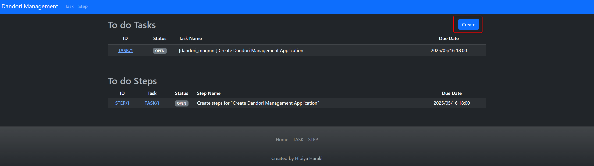
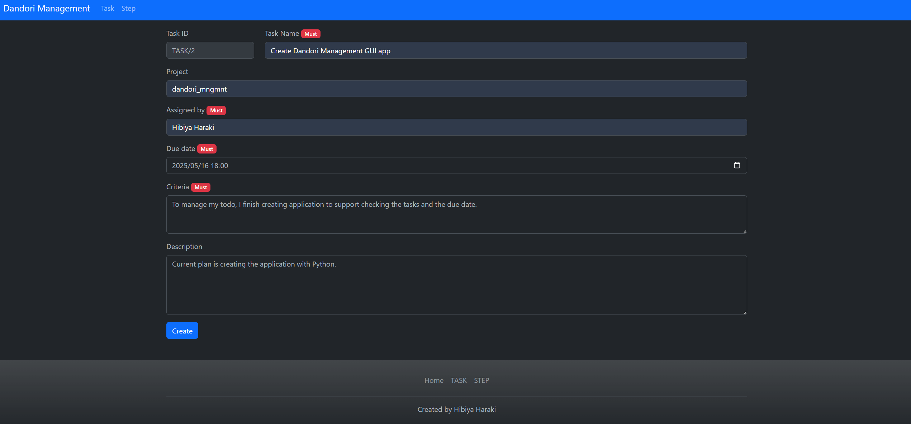
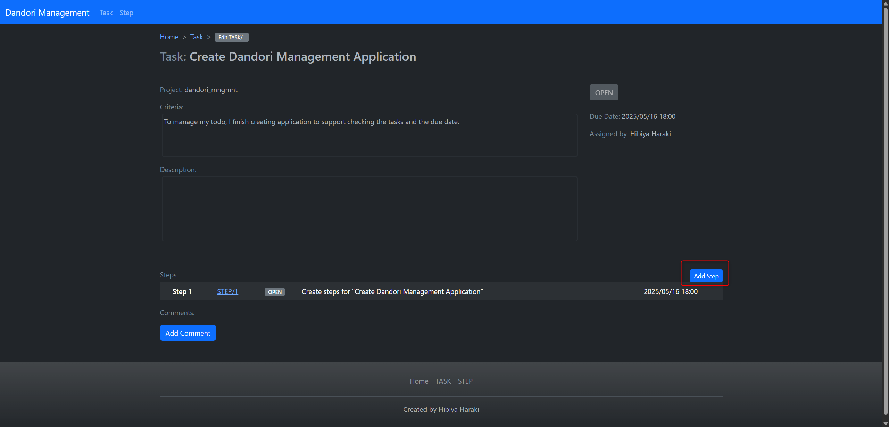
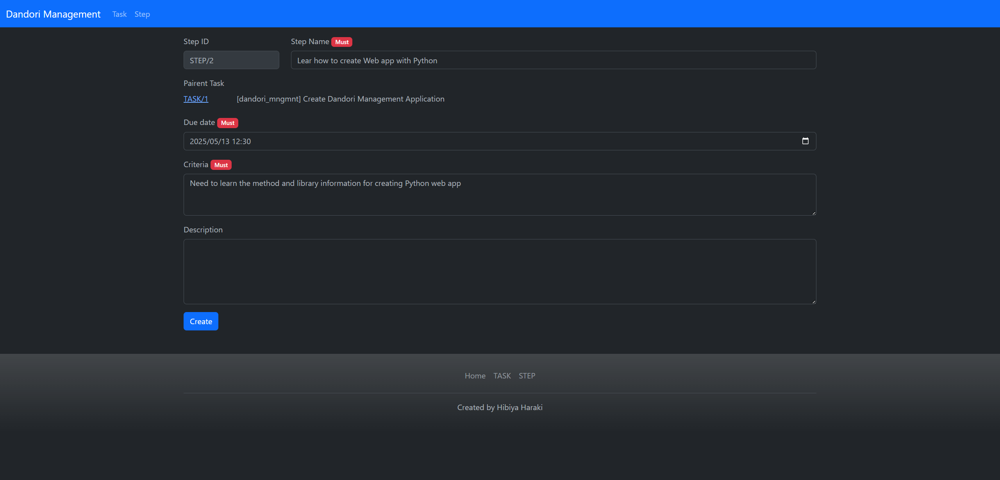
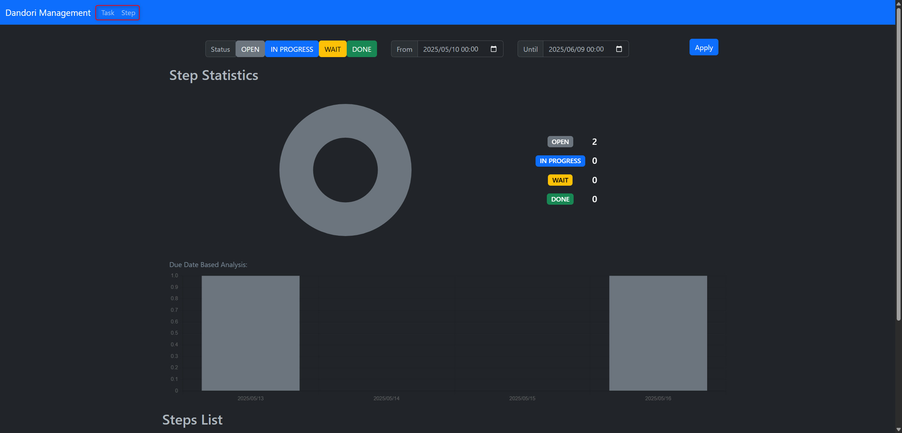
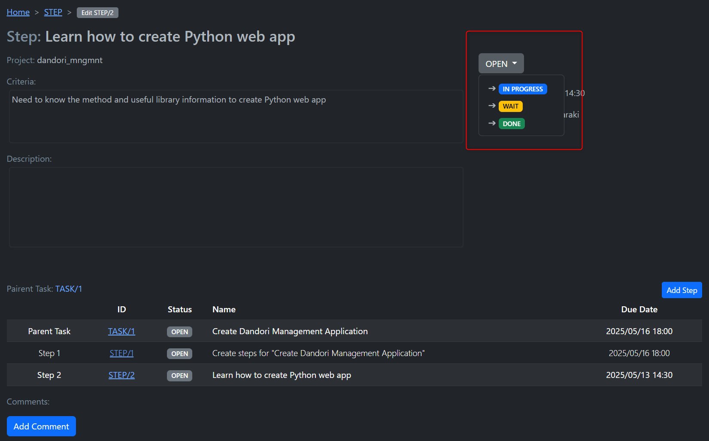

# Dandori Management

May 2025, created by Hibiya Haraki

The risk of running this script is always with you.

## What is Dandori Management?
A lot of new-grads learn that Dnadori is most important to work as adult. However, I am not good at doing this. Therefore, I created a Todo manageement application which focus on the work steps. This app runon browther and created by Python Flask.

## Build environment

### Install Python 
You ned to install [Python](https://www.python.org/downloads/release/python-3110/) at first. 

### Install necessary modules
Then you need to install Flask by following commands.

```
pip install flask flask-sqlalchemy
```

### Start dandori_mngmnt
After that, you can start this web application by following command.

```
start_dandori_mngmnt.bat
```

## How to use this app
This Todo management app have 2 kind of to do format

### Data type
In this application we manage our to do by splitting 2 types of data.

1. Task
2. Step

In this app, we think that we get "Task" from other person. Then we make "Steps" for achieve the "Task".

### How to create Task
1. You can create Task by the button at top page.
    
2. You need to input the necessary information about "Task"
    

### How to create Step
"Step" is the process for achieving a "Task". Therefore, we can create "Step" only under specific "Task". 

1. We need to select a task you want to add "Step". Then start to create "Step".
    
2. Then, we need to input some information for creating "Step".
    
3. On the task page you can see added step for achieving a "Task"
    

### Functions
On this function, we can do following things.
* Create new Task & Steps
* Edit existed Task & Steps
* Check the statistic result of Task & Step by graph
    
* Add comment on each Task & Step
* Manage the statusof each Task & Steps (We can change the Step status manually. Task status automatically change due to the steps status.)
    